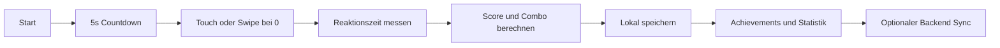
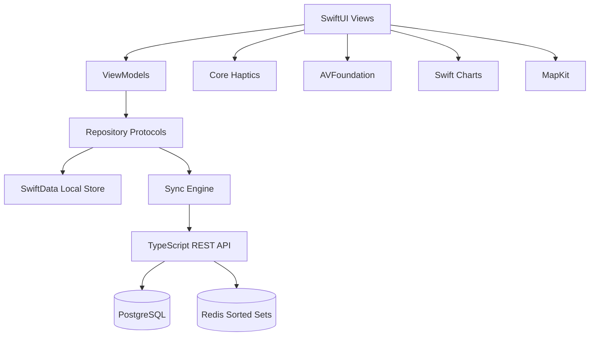

<div align="center">

# FlourTrack

### Native iPhone Arcade-Timing für virtuelles Mehl

**Countdown -> Swipe -> Score -> Streaks -> Year in Swipe**

[](./HANDOVER.md)
[](https://developer.apple.com/ios/)
[](https://developer.apple.com/xcode/swiftui/)
[](https://nodejs.org/)
[](https://www.postgresql.org/)
[](https://redis.io/)

[Was ist FlourTrack?](#was-ist-flourtrack) · [Funktionsweise](#funktionsweise) · [Architektur](#architektur) · [Schnellstart](#schnellstart) · [Projektstatus](#projektstatus) · [Sicherheit](#sicherheit) · [Handover](./HANDOVER.md)

</div>

---

> [!IMPORTANT]
> FlourTrack ist ein bewusst absurdes Arcade-Spiel. Alle Mengen, Linien, Faktoren, Entfernungen und Berechnungen sind rein fiktive Spielwerte. Sie haben keinen Bezug zu realen Drogen, Dosierungen, Konsumformen oder gesundheitlichen Empfehlungen.

## Demo

Noch keine Screenshots oder App-Demo. Phase 1 liefert Infrastruktur, Datenmodell und startbaren Backend-Healthcheck. Die native iPhone-Oberfläche folgt in Phase 2.

Geplante Platzhalter:

| Screen | Status |
|---|---|
| Onboarding | geplant |
| Precision Timer | geplant |
| Ergebnisanimation | geplant |
| Year in Swipe | geplant |
| Leaderboard | geplant |

---

## Was ist FlourTrack?

FlourTrack gamifiziert das virtuelle Ziehen einer Mehl-Linie als Geschicklichkeitsspiel. Der Nutzer startet einen Countdown und muss im richtigen Moment eine Touch- oder Swipe-Geste ausführen. Bewertet werden Reaktionszeit, Genauigkeit, Combo, persönliche Rekorde, Daily Challenges und Leaderboards.

Die App soll sich wie eine hochwertige native iOS-App anfühlen: SwiftUI, SwiftData, MapKit, Charts, AVFoundation und Core Haptics statt WebView oder Cross-Platform-Port.

### Kernnutzen

| Ziel | Ansatz |
|---|---|
| Kurze Arcade-Runden | 5-Sekunden-Countdown mit präziser Touch-/Swipe-Wertung |
| Humor ohne reale Konsumbezüge | Fiktive Flour-Lines, virtuelle Distanz und absurde Vergleichstexte |
| Offline spielbar | Lokale Scores, Statistiken und Achievements über SwiftData |
| Später sozial erweiterbar | Backend-Sync, Freundschaften und Redis-Leaderboards |
| Austauschbare Leaderboards | Protocol für Backend- und Game-Center-Implementierungen |

### Geplante App-Bereiche

- Precision Timer
- Profil mit optionalem FlourTrack Factor
- Lokale Scores und Achievements
- Daily Streaks und Daily Challenges
- Freundeslisten und Freundesanfragen
- Leaderboards für Global, Friends, Today, Week und All Time
- Year in Swipe mit Charts und MapKit-Meilensteinen
- Settings für Haptics, Audio, Accessibility und Account

---

## Funktionsweise



### 1. Countdown starten

Der Hauptscreen zählt von 5 bis 0. Haptics begleiten die Countdown-Stufen, sofern der Nutzer sie aktiviert hat.

### 2. Präzision messen

Bei `0` zählt die zeitliche Abweichung in Millisekunden. Daraus entsteht eine Bewertung wie Perfect, Excellent, Good, Okay oder Too Slow.

### 3. Score berechnen

Der Score kombiniert Genauigkeit und Combo-Multiplikator. Jede Runde erzeugt einen append-only Spielversuch mit `client_game_id`, damit spätere Sync-Retries idempotent bleiben.

### 4. Lokal speichern

Die App ist offline-first. Scores, Statistiken und Achievements funktionieren ohne Account und ohne Backend.

### 5. Optional synchronisieren

Wenn ein Account verwendet wird, synchronisiert eine spätere Sync Engine lokale Spielversuche mit dem Backend. PostgreSQL bleibt Source of Truth, Redis hält nur ableitbare Leaderboard-Projektionen.

---

## Architektur



### Technologie-Stack

| Bereich | Technologie | Aufgabe |
|---|---|---|
| iPhone-App | Swift, SwiftUI, iOS 18+ | Native App, Navigation und Game UI |
| Lokale Daten | SwiftData | Offline Scores, Profil, Achievements und Statistiken |
| Backend API | Node.js 22, TypeScript, Fastify | REST API, Healthchecks, spätere Sync-Endpunkte |
| Datenbank | PostgreSQL 17 | Source of Truth für Nutzer, Spiele, Freundschaften und Aggregate |
| Leaderboards | Redis 7.4 Sorted Sets | Schnelle Tages-, Wochen- und All-Time-Rankings |
| Container | Docker Compose, OCI Images | Lokale Entwicklungsumgebung |
| Dokumentation | OpenAPI 3.1 | API-Vertrag |

### Backend-Struktur

```text
backend/
├── src/
│   ├── database/
│   ├── redis/
│   ├── middleware/
│   ├── modules/
│   │   ├── auth/
│   │   ├── users/
│   │   ├── games/
│   │   ├── friends/
│   │   ├── leaderboard/
│   │   └── statistics/
│   └── server.ts
├── migrations/
├── tests/
├── Dockerfile
├── package.json
└── tsconfig.json
```

### Datenmodell

Die erste Migration erstellt:

| Tabelle | Zweck |
|---|---|
| `users` | Gast- und spätere Apple-Accounts |
| `profiles` | Anzeigename, Avatar, optionaler FlourTrack Factor |
| `games` | Spielversuche, Scores, virtuelle Distanz |
| `friendships` | Freundschaftsanfragen und Status |
| `achievements` | Erweiterbare Achievement-Definitionen |
| `user_achievements` | Freigeschaltete Achievements |
| `daily_challenges` | Tägliche Challenges |
| `user_challenges` | Challenge-Fortschritt je Nutzer |
| `yearly_statistics` | Year-in-Swipe-Aggregate |

---

## Schnellstart

### Voraussetzungen

- Git
- Xcode mit iOS 18+ SDK
- Node.js 22 für lokale Backend-Checks
- Docker für den vollständigen Backend-Stack

### Repository klonen

```bash
git clone https://github.com/arn0ld87/flourtrack.git
cd flourtrack
```

### Backend lokal starten

```bash
cp .env.example .env
docker compose up -d --build
curl http://127.0.0.1:8080/health/ready
```

Falls lokale Standardports belegt sind, `.env` anpassen:

```text
POSTGRES_PORT=15432
REDIS_PORT=16379
BACKEND_PORT=18080
```

Danach:

```bash
docker compose up -d --build
curl http://127.0.0.1:18080/health/ready
```

### Docker auf armserver

Im aktuellen Setup ist lokaler Docker auf dem Mac nicht erreichbar. Der Stack wurde auf `armserver` validiert:

```bash
ssh armserver
cd /Volumes/T7/Projekte/iosapp_august
docker compose up -d --build
curl http://127.0.0.1:18080/health/ready
```

| Dienst | Remote-Adresse | Funktion |
|---|---|---|
| Backend | `http://127.0.0.1:18080` | REST API und Healthchecks |
| PostgreSQL | `127.0.0.1:15432` | Relationale Datenbank |
| Redis | `127.0.0.1:16379` | Leaderboard-Projektionen |

### Backend prüfen

```bash
cd backend
npm install
npm run build
npm audit --audit-level=moderate
```

### Datenbank prüfen

```bash
docker compose exec postgres pg_isready -U flourtrack -d flourtrack
docker compose exec postgres psql -U flourtrack -d flourtrack -c "\dt"
docker compose exec postgres psql -U flourtrack -d flourtrack -c "select code from achievements order by code;"
```

### Redis prüfen

```bash
docker compose exec redis redis-cli ping
docker compose exec redis redis-cli zadd leaderboard:daily:global:$(date -u +%F) 123 ft_localtest123456
docker compose exec redis redis-cli zrevrange leaderboard:daily:global:$(date -u +%F) 0 -1 withscores
```

### iOS starten

Der iOS-Teil ist aktuell noch der minimale Xcode-Projektstand. Phase 2 baut App Entry Point, Navigation, Models, Repository-Protokolle und SwiftData-Setup.

```bash
open "Untitled Project.xcodeproj"
```

---

## Projektstatus

**Aktueller Stand:** Phase 1 abgeschlossen

| Bereich | Stand |
|---|---|
| Architekturentscheidung | erledigt |
| PostgreSQL-Schema | erledigt |
| Migrationen | erledigt |
| Redis-Konzept | erledigt |
| Docker Compose | erledigt |
| Backend-Dockerfile | erledigt |
| `.env.example` | erledigt |
| Backend Healthcheck | erledigt |
| iOS Skeleton | nächster Schritt |
| Core Game | geplant |
| Backend APIs | geplant |
| Statistiken | geplant |
| Social | geplant |
| CI und README-Ausbau | geplant |

Phase-1-Verifikation auf `armserver`:

```text
[x] PostgreSQL läuft
[x] Redis läuft
[x] Migration erfolgreich
[x] Backend Container läuft
[x] Healthcheck erfolgreich
```

---

## Sicherheit

> [!WARNING]
> Der aktuelle Backend-Stack ist für lokale Entwicklung ausgelegt. Nicht ungeschützt öffentlich betreiben.

Berücksichtigt in Phase 1:

- Keine Secrets im Repository.
- `.env.example` statt `.env`.
- Fastify Helmet.
- Rate Limiting.
- Redaction sensibler Log-Felder.
- PostgreSQL als persistente Source of Truth.
- Redis nur für rekonstruierbare Leaderboard-Daten.
- Container laufen mit nicht-root Nutzer im Backend-Runtime-Image.

Spätere Phasen:

- Sign in with Apple.
- Token-Speicherung in der iOS Keychain.
- Input Validation je API-Endpunkt.
- TLS für Produktion.
- OWASP-orientierte API- und Dependency-Prüfung.

---

## Dokumentation

- [Phase-1-Architektur](./docs/phase-1-architecture.md)
- [Handover für nächste Session](./HANDOVER.md)
- [Initiale PostgreSQL-Migration](./backend/migrations/001_initial_schema.sql)
- [Compose Stack](./compose.yaml)
- [Environment Beispiel](./.env.example)

---

## Mitwirken

Aktuell ist das Projekt im frühen Aufbau. Vor größeren Änderungen bitte die Phasenreihenfolge aus `HANDOVER.md` beachten und nach jeder Phase Build, Tests und Healthchecks ausführen.
